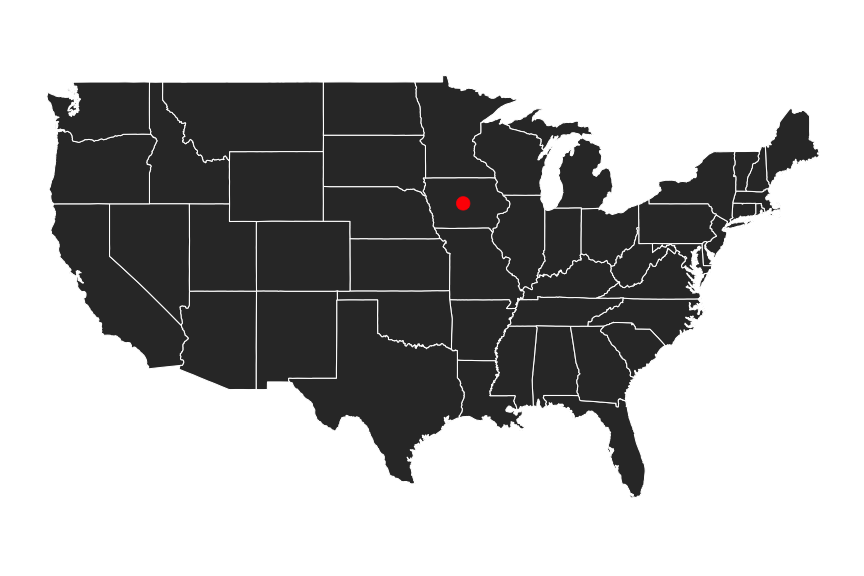
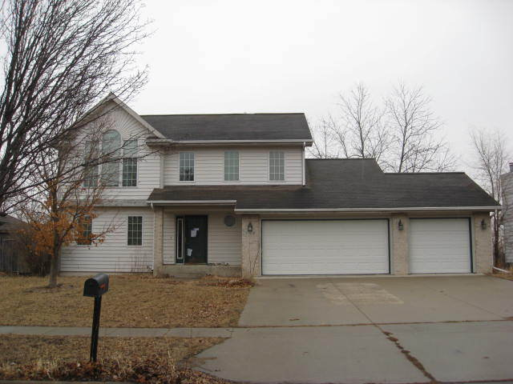
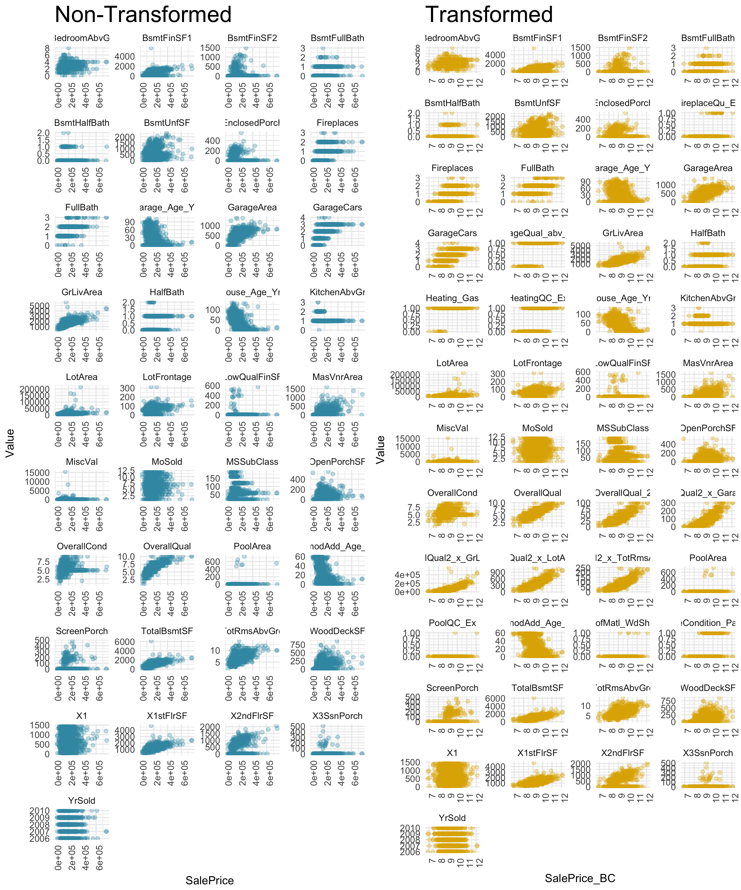

DATA 621 Final Presentation 
========================================================
author: Kyle Gilde, Jaan Bernberg, Kai Lukowiak, Michael Muller, Ilya Kats
date: 2018-05-24
autosize: true

Abstract
========================================================

***

* Understanding the factors that go into buying a house is important.
* Investigated prices in Aimes Iowa.
* Most important factors:
  * Location
  * Condition
  

Introduction
========================================================

***
The data was originally published in the Journal of Statistics Education (Volume 19, Number 3). It is now part of a long running Kaaggle competition.

The features describe attributes of the houses such as siding condition and neighborhood. They are both numeric and categorical.

Literature Review
========================================================

There is extensive literature on house prices:
* Non-physical characteristics are important.
  * Problematic because we have mostly physical data.
* Neighboring house prices are important but not included. 

Methodology 1
===

The data is split almost equally into training and test data. 

## Data imputation
Some NA values like pool quality were `NA` if there was no pool. values like this were updated
to reflect their actual status.

After these were fixed, there was only 2% of values missing.
***

Methodology 2
===

Values for both categorical and continuous variables were imputed using `mice` and the random Forrest imputation method.

The density plots for the various imputed values can be see here. 

***

Transformations
===

We created a new variable, age, which was the age at which the house was sold. Any negative values were set to zero.

Ordered categorical variables such as `HeatingQC` that did not have overlapping interquartile ranges were changed to a single dummy variable. For example, if `HeatingQC == Excellent` and `HeatingQC != Excellent` did not have overlapping IQRs, they would be transformed into a dummy variable. This increases on degrees of freedom.

Interaction terms were created via a grid search and selected based on their individual $R^2$ values.

Transformations 2
===

Finally a Box-Cox transformation was performed. The optimal $\lambda$ was found to be 0.184. This means that the response variable `SalePrice` was raised to the 0.184 power.

Visible in the scatter plots, many of the relationships become more linear.

***

Modeling
===

There were six models used: 

<table class="table" style="font-size: 12px; margin-left: auto; margin-right: auto;">
 <thead>
  <tr>
   <th style="text-align:left;"> Model </th>
   <th style="text-align:right;"> Multiple R^2 </th>
   <th style="text-align:right;"> Adjusted R^2 </th>
   <th style="text-align:right;"> AIC </th>
   <th style="text-align:right;"> Kaggle Score </th>
   <th style="text-align:left;"> Description </th>
  </tr>
 </thead>
<tbody>
  <tr>
   <td style="text-align:left;"> Model 1 (Box-Cox) </td>
   <td style="text-align:right;"> 0.9359 </td>
   <td style="text-align:right;"> 0.9241 </td>
   <td style="text-align:right;"> -531 </td>
   <td style="text-align:right;"> NA </td>
   <td style="text-align:left;"> All variables, Box-Cox and other transformations </td>
  </tr>
  <tr>
   <td style="text-align:left;"> Model 2 (Box-Cox) </td>
   <td style="text-align:right;"> 0.9330 </td>
   <td style="text-align:right;"> 0.9252 </td>
   <td style="text-align:right;"> -617 </td>
   <td style="text-align:right;"> NA </td>
   <td style="text-align:left;"> Model 1 with backwards stepwise regression, not statistically different </td>
  </tr>
  <tr>
   <td style="text-align:left;"> Model 3 (Box-Cox) </td>
   <td style="text-align:right;"> 0.8934 </td>
   <td style="text-align:right;"> 0.8890 </td>
   <td style="text-align:right;"> -126 </td>
   <td style="text-align:right;"> NA </td>
   <td style="text-align:left;"> Only highly significant variables  selected. Significant difference from model 1 </td>
  </tr>
  <tr>
   <td style="text-align:left;"> Model 4 (Box-Cox) </td>
   <td style="text-align:right;"> 0.9193 </td>
   <td style="text-align:right;"> 0.9131 </td>
   <td style="text-align:right;"> -440 </td>
   <td style="text-align:right;"> NA </td>
   <td style="text-align:left;"> Only results with p&lt;0.01 selected. </td>
  </tr>
  <tr>
   <td style="text-align:left;"> Model 5 (Original) </td>
   <td style="text-align:right;"> 0.8935 </td>
   <td style="text-align:right;"> 0.8857 </td>
   <td style="text-align:right;"> -1604 </td>
   <td style="text-align:right;"> 0.14751 </td>
   <td style="text-align:left;"> This model uses the original data with log transformed price and area </td>
  </tr>
  <tr>
   <td style="text-align:left;"> Model 6 (Transformed) </td>
   <td style="text-align:right;"> 0.9183 </td>
   <td style="text-align:right;"> 0.9120 </td>
   <td style="text-align:right;"> -1982 </td>
   <td style="text-align:right;"> 0.13846 </td>
   <td style="text-align:left;"> Based on model 4 but with interactions and no Box-Cox </td>
  </tr>
</tbody>
</table>

Model Selection
===

Model 6 had the best performance both on the training data, as well as the best kaggle score. As such, we are not worried about over fitting. It had multiple R2 of 0.9276, adjusted R2 of 0.9225, AIC of -2172 and Kaggle score of 0.13376. These are the best values in all categories.

***

Conclusion
===
Examining the coefficients on the model, we are reminded of the old rel estate adage, 'Location, Location, Location.'

Other factors such as condition also played a role. Further, it is unlikely that this model will transfer to other geographic areas and should only be used to estimate houses in the mid west. 

Finally, we did not use non-linear approaches like random forests or support vector machines. 
